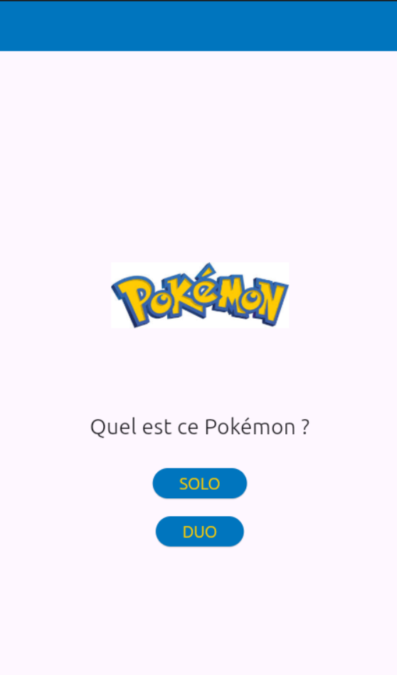
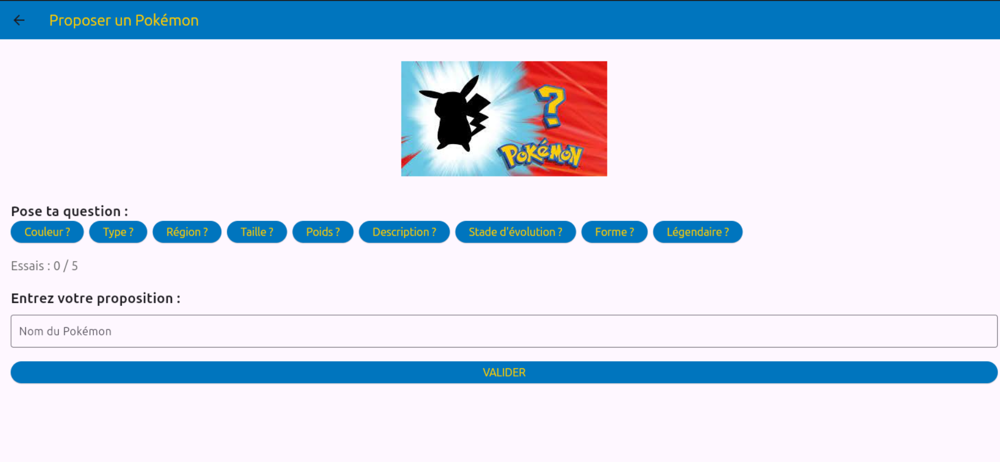
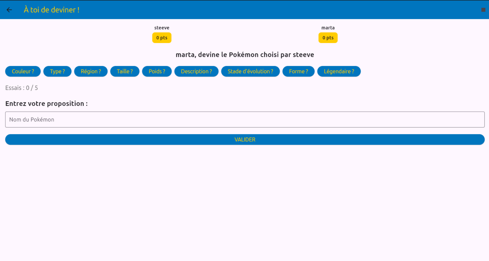
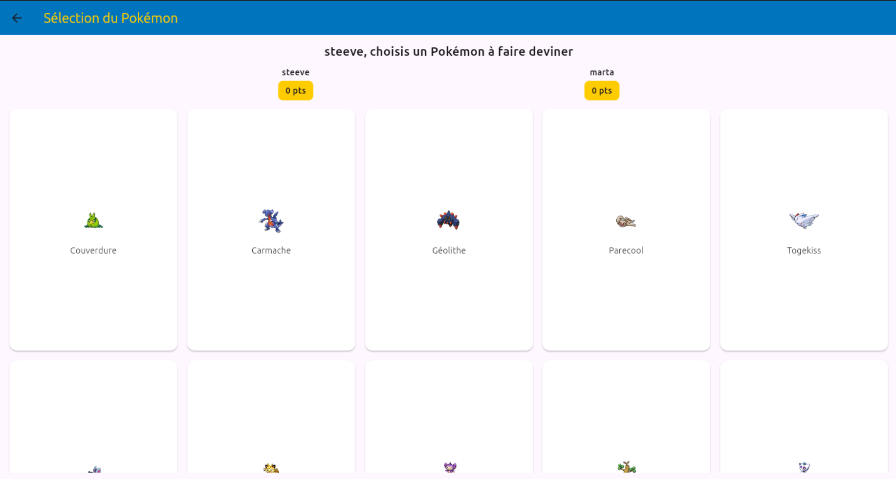
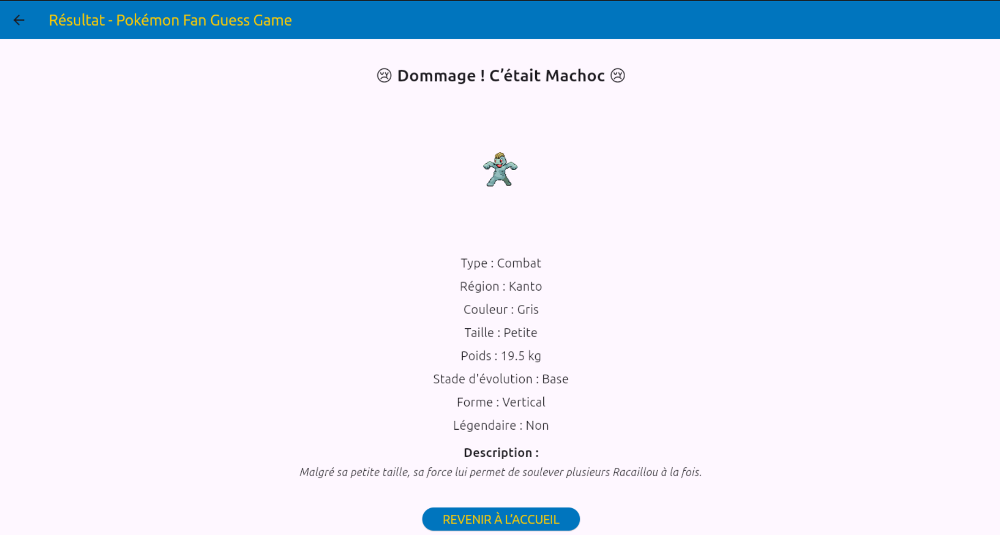

# Fan Pokémon Guess Game

**Jeu de devinette Pokémon réalisé en Flutter**

---

## 🖼️ Aperçu en images

<p align="center">
  
  <br/><em>Accueil de l'application</em>
</p>

<p align="center">
  
  <br/><em>Mode Solo : devinez le Pokémon</em>
</p>

<p align="center">
  
  <br/><em>Mode Duo : saisie des joueurs</em>
</p>

<p align="center">
  
  <br/><em>Sélection de 50 Pokémon aléatoires en mode Duo</em>
</p>

<p align="center">
  
  <br/><em>Écran de résultat et indices détaillés</em>
</p>

---

## 🆕 Nouveautés majeures

- **Mode Duo** : affrontez un ami, chacun choisit un Pokémon à faire deviner à l'autre, scores visibles, parties infinies, récapitulatif final.
- **Sélection ultra-rapide** : affichage de 50 Pokémon aléatoires en vignettes grâce à des requêtes parallélisées.
- **Stade d'évolution fiable** : l'indice "stade d'évolution" fonctionne pour tous les Pokémon (Bébé, Base, Intermédiaire, Finale), même pour les cas complexes.
- **Validation tolérante** : la casse, les accents, les espaces, les symboles de genre (♂, ♀) et les variantes de nom sont ignorés lors de la validation.
- **Expérience utilisateur fluide** : navigation claire, scores visibles, arrêt manuel possible, retour à l'accueil à tout moment.

---

## 📖 Description

Ce projet est un jeu de devinette pour les fans de Pokémon. Le but est de deviner le nom d'un Pokémon à partir de ses caractéristiques (type, couleur, région, etc.). L'application utilise l'API publique PokéAPI pour récupérer les données des Pokémon.

> **⚠️ Ce projet est un fan game non officiel. Il n'est pas affilié, sponsorisé ou approuvé par The Pokémon Company, Nintendo, Game Freak ou toute entité officielle liée à Pokémon. Les noms, images et données utilisés sont la propriété de leurs détenteurs respectifs. Ce projet est réalisé à des fins éducatives et ludiques uniquement.**

---

## 🎮 Fonctionnalités

### Mode Solo
- Devinez le Pokémon à partir d'indices révélés progressivement
- 5 essais maximum
- Solution affichée en cas d'échec

### Mode Duo
- Deux joueurs, chacun choisit un Pokémon à faire deviner à l'autre
- Sélection parmi 50 Pokémon aléatoires (sprites + noms)
- 5 essais par manche, scores visibles en permanence
- +10 points pour une bonne réponse, -2 points par mauvaise réponse
- Rôles inversés à chaque manche, parties infinies jusqu'à arrêt manuel
- Récapitulatif final avec tableau des scores et gagnant

### Indices disponibles
- Type(s) du Pokémon
- Couleur
- Région d'origine
- Taille (Petite/Grande)
- Poids
- Description
- **Stade d'évolution** (Bébé, Base, Intermédiaire, Finale)
- Forme
- Statut légendaire

### Validation intelligente
- Insensible à la casse, aux accents, aux espaces, aux symboles de genre (♂, ♀)
- Les variantes de nom (ex : Nidoran, Mr. Mime, Farfetch’d) sont acceptées

### Interface
- Design moderne avec les couleurs Pokémon (bleu #0075BE et jaune #FFCC00)
- Interface responsive et intuitive
- Animations fluides
- Support multi-plateforme

---

## 🛠️ Technologies utilisées

- **Framework** : [Flutter](https://flutter.dev/) 3.0+
- **Langage** : [Dart](https://dart.dev/) 3.0+
- **État** : [Provider](https://pub.dev/packages/provider) pour la gestion d'état
- **HTTP** : [http](https://pub.dev/packages/http) pour les requêtes API
- **API** : [PokéAPI](https://pokeapi.co/) pour les données Pokémon
- **Architecture** : Pattern Provider avec séparation des responsabilités

---

## 📁 Structure du projet

```
lib/
├── main.dart                 # Point d'entrée de l'application
├── models/
│   └── pokemon.dart         # Modèle de données Pokémon
├── providers/
│   └── pokemon_provider.dart # Gestionnaire d'état
├── screens/
│   ├── accueil_screen.dart  # Écran d'accueil
│   ├── solo_screen.dart     # Écran du mode solo
│   ├── solo_proposition_screen.dart # Interface de jeu solo
│   ├── solo_resultat_screen.dart   # Écran de résultat solo
│   ├── duo_player_names_screen.dart # Saisie des joueurs duo
│   ├── duo_pokemon_selection_screen.dart # Sélection du Pokémon en duo
│   ├── duo_guess_screen.dart # Devinette en duo
│   └── duo_recap_screen.dart # Récapitulatif final duo
├── services/
│   └── pokemon_service.dart # Service API et logique métier
├── utils/
│   └── string_utils.dart    # Utilitaires de normalisation
└── widgets/                 # Widgets réutilisables
```

---

## 🚀 Installation

### Prérequis
- [Flutter](https://flutter.dev/docs/get-started/install) 3.0+ installé
- [Git](https://git-scm.com/) installé
- Un accès à internet (pour récupérer les données Pokémon)

### Étapes d'installation

1. **Cloner le projet** :
   ```bash
   git clone https://github.com/AntoineMLD/fan_pokemon_guess_game.git
   cd fan_pokemon_guess_game
   ```

2. **Installer les dépendances** :
   ```bash
   flutter pub get
   ```

3. **Vérifier l'installation** :
   ```bash
   flutter doctor
   ```

4. **Lancer le jeu** :
   ```bash
   # Linux
   flutter run -d linux
   
   # Windows
   flutter run -d windows
   
   # macOS
   flutter run -d macos
   
   # Web
   flutter run -d chrome
   
   # Android (avec émulateur ou appareil connecté)
   flutter run -d android
   
   # iOS (macOS uniquement)
   flutter run -d ios
   ```

---

## 🎯 Utilisation

### Démarrage
1. Lancez l'application
2. Cliquez sur le bouton "SOLO" ou "DUO" sur l'écran d'accueil
3. Suivez les instructions à l'écran

### Pendant le jeu
- Posez des questions en cliquant sur les boutons d'indices
- Proposez une réponse en tapant le nom du Pokémon
- Validez votre proposition
- Continuez jusqu'à trouver ou épuiser vos essais
- En duo, les rôles s'inversent à chaque manche

### Validation des réponses
- **Insensible à la casse** : "pikachu", "PIKACHU", "Pikachu" sont acceptés
- **Insensible aux accents** : "évoli", "evoli" sont acceptés pour "Évoli"
- **Espaces et symboles ignorés** : "Nidoran", "Nidoran♂", "Nidoran♀" sont équivalents
- **Variante de nom** : "Mr. Mime" et "mr mime" sont équivalents

---

## 🔧 Configuration

Aucune configuration requise. L'application utilise l'API publique PokéAPI.

---

## 🐛 Dépannage

**L'application ne se lance pas :**
```bash
flutter clean
flutter pub get
flutter run
```

**Erreur de connexion :**
- Vérifiez votre connexion internet
- L'API PokéAPI peut être temporairement indisponible

**Erreur de compilation :**
```bash
flutter doctor
flutter pub outdated
flutter pub upgrade
```

---

## 🤝 Contribution

Les contributions sont les bienvenues ! Pour contribuer :

1. Fork le projet
2. Créez une branche pour votre fonctionnalité (`git checkout -b feature/AmazingFeature`)
3. Committez vos changements (`git commit -m 'Add some AmazingFeature'`)
4. Push vers la branche (`git push origin feature/AmazingFeature`)
5. Ouvrez une Pull Request

---

## 📄 Licence et mentions légales

Ce projet est un **fan game**. Il n'a aucun lien officiel avec Pokémon, The Pokémon Company, Nintendo ou Game Freak. Les noms, images et données Pokémon appartiennent à leurs détenteurs respectifs.

### Utilisation des données
- Les données proviennent de l'API publique [PokéAPI](https://pokeapi.co/)
- Les images sont hébergées par PokéAPI
- Ce projet respecte les conditions d'utilisation de PokéAPI

### Contact
Si un ayant droit souhaite la modification ou la suppression de ce projet, il peut contacter le développeur via GitHub.

---

## 🙏 Remerciements

- [PokéAPI](https://pokeapi.co/) pour les données et images
- [Flutter](https://flutter.dev/) pour le framework
- La communauté Pokémon pour l'inspiration

---

**Réalisé par un fan de Pokémon, pour les fans.** 🎮✨

